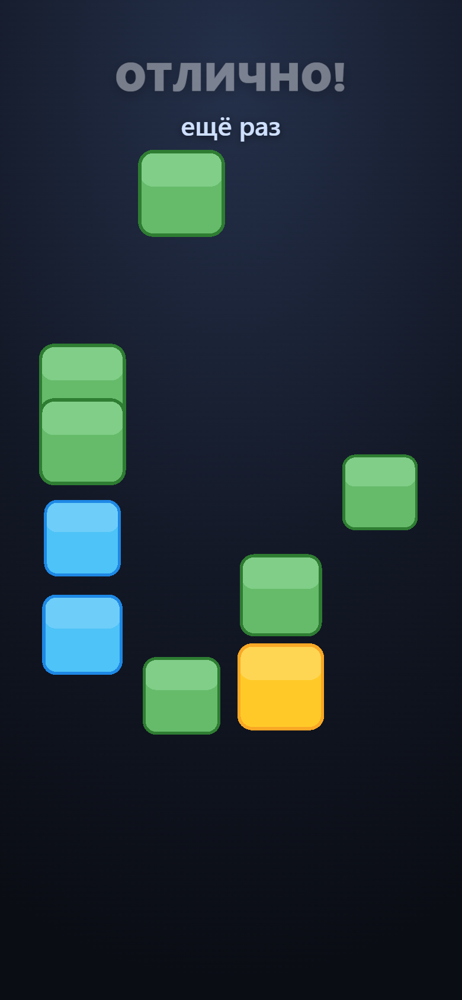
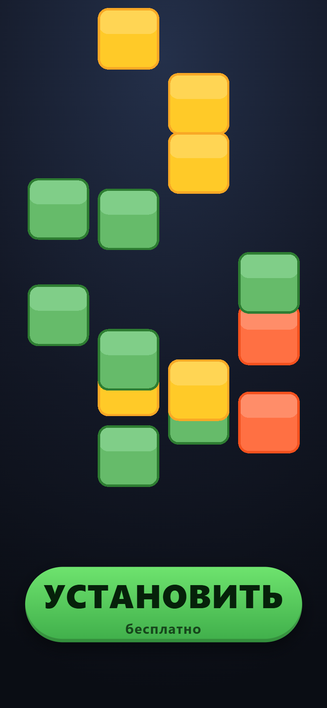
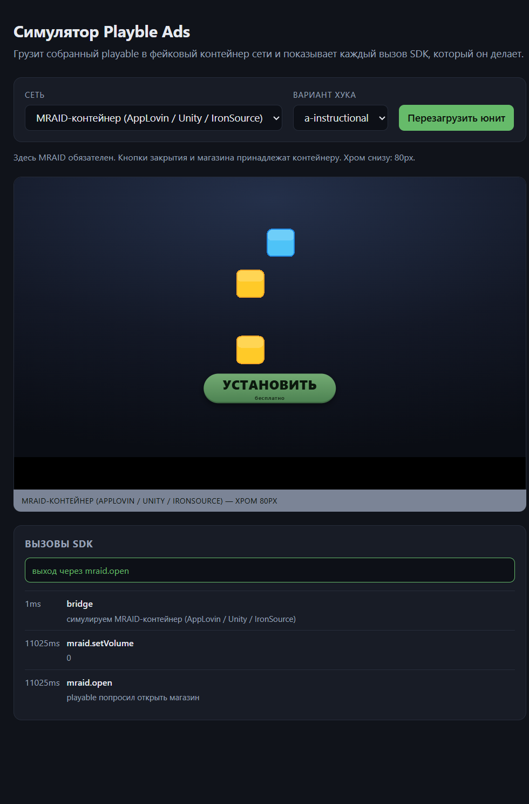

# Playble Ads

Движко-независимый SDK для HTML5 playable-рекламы, демо-креатив и симулятор
рекламных контейнеров.

Playable — это интерактивная реклама: человек играет несколько секунд в игру
внутри рекламного блока и решает, ставить ли приложение. По числу установок
формат работает лучше видео, поэтому его стоит делать правильно.

## Зачем это нужно

Любая рекламная сеть хочет HTML5 одним самодостаточным файлом, запрещает
внешние запросы и ждёт конкретный вызов для перехода в магазин. Ошибка в любом
из трёх пунктов означает отклонение на ревью загрузки — через несколько дней
после того, как креатив готов. Здесь эти ограничения становятся ошибкой сборки и
локальным тестом.

## Состав

| Путь | Что это |
|---|---|
| `packages/core` | Рантайм. Без зависимостей и без рендерера: детект сети, события, dev-guard. |
| `packages/adapters` | По модулю на рекламную сеть. Знает только то, как уйти в магазин. |
| `packages/engine` | Цикл на PixiJS, твины, пул объектов, адаптивное качество. |
| `apps/playable` | Merge-игра на этом движке. Три сборки — по одной на семейство сетей. |
| `apps/simulator` | Запускает готовую сборку в фейковом контейнере сети и логирует каждый вызов SDK. |
| `tools/spec-check` | Проверяет собранный файл против опубликованных требований всех сетей. |

## Статус

v1.0.0. Typecheck, 194 юнит-теста, сборка с проверкой спецификаций и прогон
собранного юнита в браузере — зелёные. CI прогоняет их на каждом пуше.

Два ограничения, о которых честнее сказать сразу:

- **Симулятор подделывает мост SDK и хром контейнера.** Он не подделывает
  распределение рекламы и ревью, поэтому зелёный прогон означает «механика
  работает в контейнере такой формы», а не «это пройдёт модерацию».
- **Креатив не измерен.** Тайминг и механика следуют опубликованным бенчмаркам,
  но playable для утверждения об установках нужны настоящие показы. Два
  варианта хука существуют как гипотезы, а не как результаты.

## Быстрый старт

```bash
npm install
npm run check        # typecheck, юнит-тесты и сборка с проверкой спецификаций
npm run simulator    # собрать креатив и поднять симулятор на :5174
```

Затем открыть http://localhost:5174, выбрать сеть и нажать **Reload unit**.

Прогон в браузере — отдельной командой, потому что ему нужен работающий
симулятор:

```bash
npm run smoke
```

## Как пользоваться SDK

Игра никогда не импортирует SDK рекламной сети. Она получает один объект:

```ts
import { createPlayble } from '@playble/core';
import { createAllAdapters } from '@playble/adapters';

const playable = createPlayble({
  config: { storeUrl: 'https://play.google.com/store/apps/details?id=com.example' },
  adapters: createAllAdapters(),
});

playable.on('ctaTap', ({ via }) => console.log('установлено через', via));

// ...в коде игры, когда игрок нажал кнопку установки:
playable.install();
```

`install()` сам выбирает нужный вызов: `mraid.open()`, `FbPlayableAd.onCTAClick()`,
`ExitApi.exit()`, `window.install()` или обычная ссылка, если SDK сети нет.

## Поддержка сетей

| Сеть | Выход в магазин | Лимит | MRAID | Звук |
|---|---|---|---|---|
| Meta, Moloco | `FbPlayableAd.onCTAClick()` | 2 МБ | **запрещён** | по жесту |
| Google / AdMob | `ExitApi.exit()` | 5 МБ | не используется | по жесту |
| AppLovin MAX | `mraid.open()` | 5 МБ | обязателен | по жесту |
| Unity Ads | `mraid.open()` | 5 МБ | обязателен | по жесту |
| IronSource / LevelPlay | `mraid.open()` | 5 МБ | обязателен | по жесту |
| Vungle | `mraid.open()` | 5 МБ | обязателен | по жесту |
| Chartboost, InMobi | `mraid.open()` | не указан | обязателен | по жесту |
| Mintegral | `window.install()` | 5 МБ | не используется | по жесту |
| TikTok, Pangle | `window.openAppStore()` | 5 МБ | не используется | **включён** |
| Liftoff | `postMessage("download")` | 700 КБ рекомендуется | не используется | по жесту |
| сеть не найдена | `window.open` | — | — | по жесту |

Две детали в этой таблице определяют реальные решения в коде:

- **Meta запрещает MRAID полностью** — не «неиспользуемый», а любое упоминание в
  файле. Поэтому в `apps/playable` три отдельные сборки, и в Meta-версии адаптер
  MRAID не импортируется вообще. См. `apps/playable/src/targets/`.
- **MRAID-сети неразличимы на рантайме.** AppLovin, Unity, IronSource и Vungle
  дают MRAID и почти ничего больше. Определить конкретную сеть нельзя, поэтому
  юниты закрепляются через `config.network`. См.
  `packages/adapters/src/networks.ts`.

## Симулятор

`npm run simulator` грузит собранный playable в фейковый контейнер с
подставленным SDK выбранной сети и логирует все его вызовы. CTA, который уходит
не через тот API или который перекрыт хромом самой сети, видно сразу, а не на
ревью загрузки.

Загружается именно собранный артефакт, а не dev-сборка игры: размер и инлайн
ассетов — как раз то, что приводит к отклонению, и в dev-сборке этого не видно.

## Валидация

`npm run build` собирает по артефакту на семейство сетей и проверяет каждый
против требований всех сетей: размер файла, внешние запросы, внешние скрипты,
использование MRAID и обязательный вызов выхода. Ошибка роняет сборку.

```
[playble] checking meta.html (592.7 KB) for Meta and Moloco
meta.html  592.7 KB
OK accepted by: Unity Ads
```

Проверка намеренно ограничена тем, что доказуемо из самого файла. Хорош ли
креатив — статическая проверка не ответит.

## Документация

- [`docs/architecture.md`](docs/architecture.md) — как всё устроено и почему
- [`docs/adr/`](docs/adr/) — решения, которые стоит обсуждать, с обоснованием
- [`docs/playable-design.md`](docs/playable-design.md) — творческая часть: тайминг, механика и что говорят бенчмарки

## Скриншоты

Демо-креатив на третьем уровне: доска живая, кнопка установки ещё не появилась.



Энд-кард после победы. Кнопка появляется только после выигрыша — это требование
тайминга, а не украшение.



Симулятор в MRAID-контейнере: каждый вызов SDK, который сделал playable,
и фактический способ выхода.



## Дорожная карта

Открытые задачи содержат обоснование, а не только формулировку:

- [E2E на Playwright для симулятора](https://github.com/Kerarty/playble-ads/issues/2)
- [Измерить два варианта хука](https://github.com/Kerarty/playble-ads/issues/3)
- [Выложить симулятор на GitHub Pages](https://github.com/Kerarty/playble-ads/issues/4)
- [Реальные контейнеры против симулятора](https://github.com/Kerarty/playble-ads/issues/5)
- [Атрибуция метрик к отдающей сети](https://github.com/Kerarty/playble-ads/issues/6)

## Тесты

```bash
npm test        # юнит-тесты, без браузера
npm run smoke   # прогон настоящей сборки в настоящем браузере
```

`npm test` покрывает то, что может сломаться без рендерера: правила слияния,
решаемость уровней, геометрия доски, цикл с фиксированным шагом, валидация
конфига, определение и выбор сети, сама проверка спецификаций. Правила игры
живут в коде, который не импортирует Pixi, поэтому проверяются без браузера.

`npm run smoke` нужен потому, что целый класс багов юнит-тестами не ловится
вообще. Он открывает собранный юнит в Chrome, играет в него настоящими
событиями указателя по экранным координатам и проверяет:

- рендерер и DOM-оверлеи показывают блок в одной точке (иначе картинка верная,
  а нажатия игнорируются);
- доска помещается в дизайн-бокс и клетка остаётся достаточно крупной, чтобы
  попасть пальцем;
- раунд доигрывается до CTA в четырёх размерах слота;
- каждая из шести сетей выходит через свой API.

Все четыре бага, описанных ниже, нашлись именно так. Запускается против
`npm run simulator`, браузер берётся системный, ничего не докачивается.

## Что нашлось при прогоне в браузере

Четыре настоящих бага, которые юнит-тесты пропустили:

1. **Доска вставала в тупик.** Слияние съедает два блока и даёт один, пары
   кончались, и на доске оставались свободные клетки без возможности что-либо
   слить. Тест на решаемость гонял 60 сидов и не поймал.
2. **`get()` не проверял границы.** `Board.index` — обычная арифметика, поэтому
   `get(4, 0)` перескакивал на индекс 4, то есть на блок Directly ниже. Клетка
   у правого края считала, что у неё есть сосед слева, и долив ставил блоки не
   туда. Ничего не падало — доска просто переставала иметь смысл.
3. **Одинокая блок-долив.** Когда нулевых блоков не оставалось совсем, правило
   ставило один-единственный нулевой блок в случайную клетку. Сливать его не с
   чем. Теперь ставится пара.
4. **Геометрия мира считалась не туда.** Блоки уезжали в левый верхний угол, а
   ввод продолжал работать, потому что идёт через transform DOM-оверлея. Два
   разных набора координат, сломан был один, и исключение не бросалось.

## Лицензия

MIT
